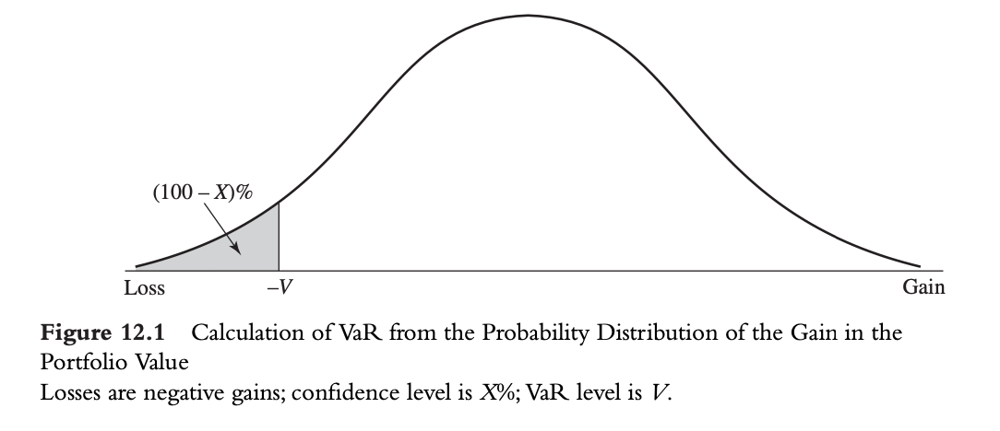

# VaR

## 1. VaR定义和算例

- 有$x\%$的把握，在$T$时间段，损失不会大于$V$，此$V$即为该portfolio的VaR
- VaR是时间$T$与置信度$x\%$的函数
- VaR测算的是在一定时间内，在一定的把握下，交易损失的最大值
- 相当于尾部分位数
  
- VaR的优点
  - 容易理解：最坏的情况是怎样
- VaR的缺点
  - 只展示了分位点点信息，没有提供任何关于更低于分布的极端尾部损失信息
  - VaR不一定会鼓励分散化投资（资产组合的VaR可能大于两个资产的VaR的组合）

## 2. 预期亏损

- 由于VaR刻画不了尾部风险，需要具体给出在$T$时间内超出$X$分位数的条件下，损失的期望值

  $$
  ES_X(Z)=\frac{1}{1-X}\int_X^1VaR_\gamma(Z) \mathrm{d}\gamma
  $$
- 因此预期亏损会考虑到尾部的损失分布

## 3. 一致性风险测度

- 是一种评价风险测度工具的好坏的标准
- 一致性风险测度的性质 Artzner, etc.（1999）：

  - 单调性
    - 收益小的投资组合对应的风险度量更大
  - 平移不变性
    - 组合加入$K$单位的无风险资产，风险度量就要减少$K$单位
  - 同质性
    - 成比例扩大一个组合$n$倍，则风险测度也扩大同样倍数
  - 次可加性
    - 投资组合分散风险后应当小于单纯两个投资项目的风险的加和

  ***VaR不是一致性风险测度（不满足次可加性）***

  |        | 单调性 | 平移不变性 | 同质性 | 次可加性 |
  | ------ | ------ | ---------- | ------ | -------- |
  | 标准差 | ❌     | ❌         | ✅     | ✅       |
  | VaR    | ✅     | ✅         | ✅     | ❌       |
  | ES     | ✅     | ✅         | ✅     | ✅       |

## 4. 正态分布下的VaR与ES的计算

$$
VaR = \mu + \sigma N^{-1}(X)\\
ES = \mu + \frac{\sigma e^{-N^{-1}(X)^2/2}}{\sqrt{2\pi}(1-X)}

$$

### 时间展望期

- 对于iid的交易组合，$T$天的标准差是一天的标准差的$\sqrt T$倍

  $$
  T - day VaR = 1 - day VaR \times \sqrt T
  $$
- 若存在相关性则需要进一步考虑相关性影响

  $$
  \sigma \sqrt{T +2(T −1)\rho+2(T −2)\rho^2 +2(T −3)\rho^3 +...2\rho^{T-1}}
  $$

### 置信水平

- AA信用评级会高达99.97%
- 置信水平的转换：改变的内容是$N^{-1}(X)$，因此只需要对应地将该数值进行转化即可

## 5. 边际VaR、递增VaR、成分VaR

- **边际VaR**：考虑投资组合中的一个资产的微小变动对于整体的变动情况
  $$
  \partial VaR/\partial X_i
  $$
- 递增：如果放弃了某一资产，投资组合如何变化
- **成分VaR**：每个资产在投资组合中的贡献度如何
  $$
  X_i \cdot \partial VaR/\partial X_i
  $$

### Euler 定理

- 对于满足同质性的风险测度$V$，有

  $$
  V = \sum _ {i=1}^M x_i \partial V/\partial x_i
  $$
- 即成分VaR的总和 恒等于 资产组合的VaR

## 6. 回顾测试

- 目的：检验计算的Var是否和实际亏损相匹配，通过将VaR作用在历史数据中，检测投资组合历史数据中超过VaR的次数
- 假设检验：

  $$
  H_0: m/n=p
  $$

  即检验不符合VaR的极端分布占回看检验天数的比例是否在统计学上接近置信水平

$$
LR_{uc} = 2\ln[(m/n)^m(1-m/n)^{n-m}]-2\ln[p^m(1-p)^{n-m}] \sim \chi^2
$$
